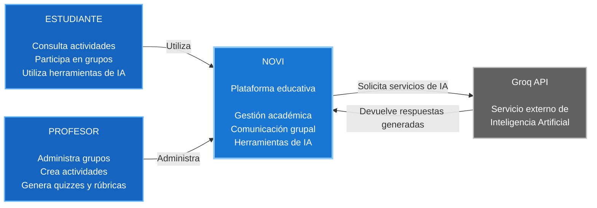

# C4 Nivel 1 — Diagrama de Contexto

## 1. Objetivo

El modelo C4 Nivel 1 representa el contexto general del sistema NOVI,
identificando los usuarios que interactúan con la plataforma y los sistemas
externos con los que NOVI establece comunicación.

## 2. Propósito de la vista

Esta vista permite comprender el sistema desde una perspectiva de alto nivel,
sin mostrar detalles internos de implementación. Se identifican los actores
principales, el sistema NOVI y el servicio externo de inteligencia artificial
utilizado por la plataforma.

## 3. Audiencia

Esta vista está dirigida a docentes, evaluadores, desarrolladores,
arquitectos de software y demás interesados que necesiten comprender el
contexto general del sistema.

## 4. Elementos del contexto

### Estudiante

Usuario de la plataforma que consulta actividades, participa en grupos y
utiliza las herramientas disponibles de inteligencia artificial.

### Profesor

Usuario responsable de administrar grupos, crear actividades y utilizar las
funcionalidades académicas y de inteligencia artificial de NOVI.

### NOVI

Plataforma educativa encargada de proporcionar las funcionalidades de gestión
académica, comunicación grupal y herramientas de inteligencia artificial.

### Groq API

Sistema externo utilizado por NOVI para proporcionar capacidades de
inteligencia artificial.

## 5. Diagrama C4 Nivel 1

