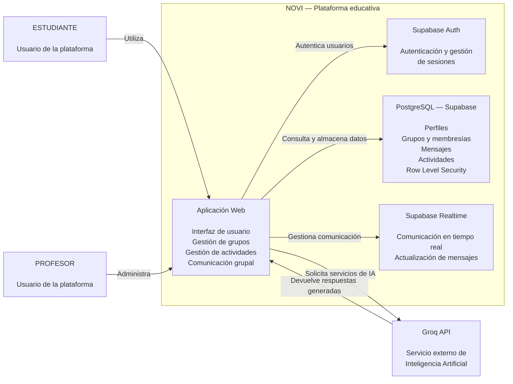

## 1. Objetivo

El modelo C4 Nivel 2 presenta los principales contenedores que conforman el
sistema NOVI y muestra cómo se relacionan entre sí, con los usuarios y con
los servicios externos utilizados por la plataforma.

Esta vista permite pasar del contexto general del sistema presentado en el
Nivel 1 a una descripción de las principales unidades tecnológicas que
implementan las funcionalidades del sistema.

## 2. Propósito de la vista

El propósito de esta vista es identificar las unidades principales que
conforman la solución tecnológica actual de NOVI y las responsabilidades
asociadas a cada una.

La vista permite comprender cómo la aplicación web se comunica con los
servicios de autenticación, persistencia de datos, comunicación en tiempo
real y servicios de inteligencia artificial.

La representación corresponde al estado actual de la solución y no a una
arquitectura futura propuesta.

## 3. Audiencia

Esta vista está dirigida principalmente a:

- Docentes y evaluadores.
- Arquitectos de software.
- Desarrolladores.
- Integrantes del equipo del proyecto.
- Personas interesadas en comprender la estructura tecnológica de NOVI.

## 4. Contenedores identificados

### 4.1 Aplicación Web

**Responsabilidad:**

Proporcionar la interfaz de usuario de NOVI y coordinar las funcionalidades
principales de gestión académica, grupos, actividades, comunicación e
inteligencia artificial.

**Tecnología:**

React 18 + Vite.

**Implementación:**

La aplicación se encuentra en el directorio:

`frontend/`

Dentro de este contenedor se encuentran las páginas, componentes y servicios
que implementan la funcionalidad de la plataforma.

---

### 4.2 Supabase Auth

**Responsabilidad:**

Gestionar la autenticación de los usuarios de la plataforma, incluyendo
registro, inicio de sesión y cierre de sesión.

**Implementación verificable:**

`frontend/src/services/auth.js`

Este módulo utiliza las operaciones de autenticación proporcionadas por
Supabase.

---

### 4.3 PostgreSQL — Supabase

**Responsabilidad:**

Almacenar y consultar la información persistente utilizada por NOVI,
incluyendo usuarios, grupos, membresías, mensajes, actividades y entregas.

**Implementación verificable:**

`database/schema.sql`

La aplicación accede a las estructuras de datos mediante el cliente de
Supabase y operaciones realizadas sobre las tablas correspondientes.

---

### 4.4 Supabase Realtime

**Responsabilidad:**

Proporcionar actualización de información en tiempo real, principalmente
para la comunicación mediante mensajes dentro de los grupos.

**Implementación verificable:**

`frontend/src/services/mensajes.js`

El módulo utiliza canales de Supabase y suscripciones a cambios mediante
`postgres_changes`.

---

### 4.5 Groq API

**Responsabilidad:**

Proporcionar los servicios externos de inteligencia artificial utilizados por
las funcionalidades de NOVI.

**Implementación verificable:**

`frontend/src/services/groq.js`

Este módulo contiene la configuración de la API y las funciones utilizadas
para realizar solicitudes de inteligencia artificial.

---

## 5. Relaciones entre contenedores

Las principales relaciones arquitectónicas identificadas son:

| Origen | Relación | Destino |
|---|---|---|
| Estudiante | Utiliza | Aplicación Web |
| Profesor | Administra | Aplicación Web |
| Aplicación Web | Autentica usuarios | Supabase Auth |
| Aplicación Web | Consulta y almacena datos | PostgreSQL — Supabase |
| Aplicación Web | Gestiona comunicación en tiempo real | Supabase Realtime |
| Aplicación Web | Solicita servicios de inteligencia artificial | Groq API |
| Groq API | Devuelve respuestas generadas | Aplicación Web |

## 6. Diagrama C4 Nivel 2

