# C4 Nivel 3 — Componentes NOVI

## 1. Objetivo

El modelo C4 Nivel 3 presenta la descomposición interna del contenedor
"Aplicación Web NOVI", identificando los componentes arquitectónicamente
relevantes que implementan las principales funcionalidades del sistema.

El objetivo de esta vista es establecer una correspondencia verificable entre
los componentes definidos en la arquitectura y los módulos, archivos y símbolos
presentes en la implementación actual del repositorio.

## 2. Alcance

Esta vista corresponde exclusivamente al contenedor "Aplicación Web NOVI"
identificado en el modelo C4 Nivel 2.

Se incluyen únicamente los componentes que poseen responsabilidad
arquitectónica relevante y que pueden ser relacionados con elementos
verificables del código fuente.

## 3. Audiencia

Esta vista está dirigida principalmente a:

- Docentes y evaluadores del proyecto.
- Arquitectos de software.
- Desarrolladores del sistema.
- Integrantes del equipo de desarrollo.

## 4. Diagrama C4 Nivel 3

El siguiente diagrama representa los componentes internos del contenedor
"Aplicación Web NOVI" y sus relaciones con los servicios externos utilizados
por el sistema.

```mermaid
  flowchart TB

    subgraph NOVI["NOVI — Aplicación Web"]
        direction TB

        subgraph CORE["Componentes funcionales"]
            direction LR

            AUTHC["Autenticación<br/><br/>
            Registro de usuarios<br/>
            Inicio de sesión<br/>
            Cierre de sesión<br/>
            Control de acceso"]

            GROUP["Gestión de Grupos<br/><br/>
            Creación y consulta de grupos<br/>
            Gestión de membresías<br/>
            Relación usuarios-grupos"]

            MSG["Gestión de Mensajes<br/><br/>
            Envío y consulta de mensajes<br/>
            Comunicación grupal<br/>
            Actualizaciones en tiempo real"]

            ACT["Gestión de Actividades<br/><br/>
            Creación y consulta de actividades<br/>
            Información de actividades<br/>
            Asociación con grupos"]
        end

        subgraph AI["Componentes de Inteligencia Artificial"]
            direction LR

            TUTOR["Asistencia Académica<br/><br/>
            Tutor NOVI<br/>
            Consultas académicas<br/>
            Apoyo a estudiantes"]

            GENACT["Generación de Actividades<br/><br/>
            Generación de títulos<br/>
            Generación de descripciones<br/>
            Basado en un tema"]

            QUIZ["Generación de Quizzes<br/><br/>
            Generación de preguntas<br/>
            Opción múltiple<br/>
            Evaluación estructurada"]

            RUBRIC["Generación de Rúbricas<br/><br/>
            Criterios de evaluación<br/>
            Niveles de evaluación<br/>
            Instrumentos de evaluación"]

            FEEDBACK["Retroalimentación<br/><br/>
            Análisis de respuestas<br/>
            Generación de observaciones<br/>
            Seguimiento académico"]

            EXPLAIN["Explicación Simplificada<br/><br/>
            Transformación de instrucciones<br/>
            Lenguaje sencillo<br/>
            Facilita la comprensión"]

            SUMMARY["Resumen del Grupo<br/><br/>
            Estado de actividades<br/>
            Recomendaciones pedagógicas<br/>
            Seguimiento del grupo"]
        end

        AUTHC -->|"Autentica"| AUTH
        GROUP -->|"Consulta y gestiona"| DB
        MSG -->|"Almacena y consulta"| DB
        ACT -->|"Almacena y consulta"| DB

        MSG -->|"Gestiona cambios en tiempo real"| RT

        TUTOR -->|"Solicita generación de contenido"| GROQ
        GENACT -->|"Solicita generación de contenido"| GROQ
        QUIZ -->|"Solicita generación de contenido"| GROQ
        RUBRIC -->|"Solicita generación de contenido"| GROQ
        FEEDBACK -->|"Solicita análisis"| GROQ
        EXPLAIN -->|"Solicita transformación"| GROQ
        SUMMARY -->|"Solicita análisis"| GROQ
    end

    AUTH["Supabase Auth<br/><br/>
    Servicio externo de autenticación"]

    DB["PostgreSQL — Supabase<br/><br/>
    Persistencia de datos<br/>
    Usuarios<br/>
    Grupos y membresías<br/>
    Mensajes<br/>
    Actividades<br/>
    Row Level Security"]

    RT["Supabase Realtime<br/><br/>
    Comunicación en tiempo real<br/>
    Suscripción a cambios"]

    GROQ["Groq API<br/><br/>
    Servicio externo de<br/>
    Inteligencia Artificial"]

    classDef component fill:#1976D2,stroke:#90CAF9,color:#FFFFFF,stroke-width:2px;
    classDef ai fill:#1565C0,stroke:#64B5F6,color:#FFFFFF,stroke-width:2px;
    classDef external fill:#616161,stroke:#BDBDBD,color:#FFFFFF,stroke-width:2px;

    class AUTHC,GROUP,MSG,ACT component;
    class TUTOR,GENACT,QUIZ,RUBRIC,FEEDBACK,EXPLAIN,SUMMARY ai;
    class AUTH,DB,RT,GROQ external;
```

---

## 6. Trazabilidad estricta

La siguiente tabla establece la correspondencia entre los elementos
arquitectónicos representados en los modelos C4 y la implementación actual
del sistema NOVI. Para cada contenedor y componente se identifica su nivel C4,
responsabilidad, archivo o módulo real, símbolo o configuración verificable,
relación arquitectónica comprobada y estado de verificación.

| Nivel C4 | Nombre exacto del elemento | Responsabilidad declarada | Archivo / módulo real que lo implementa | Clase, símbolo o configuración verificable | Relación arquitectónica comprobada | Estado de verificación |
|---|---|---|---|---|---|---|
| C2 | Aplicación Web NOVI | Proporcionar la interfaz de usuario y coordinar las funcionalidades principales de la plataforma. | `frontend/src/` | `App.jsx`, `main.jsx`, páginas y componentes React | Estudiante / Profesor → Aplicación Web NOVI | **Verificado** |
| C2 | Supabase Auth | Gestionar el registro, inicio de sesión, cierre de sesión y autenticación de usuarios. | `frontend/src/services/auth.js` | `registrarUsuario()`, `iniciarSesion()`, `cerrarSesion()`, `supabase.auth.signUp()`, `supabase.auth.signInWithPassword()`, `supabase.auth.signOut()` | Aplicación Web NOVI → Supabase Auth | **Verificado** |
| C2 | PostgreSQL — Supabase | Almacenar y consultar usuarios, grupos, membresías, mensajes y actividades. | `database/schema.sql`; `frontend/src/services/` | Tablas `users`, `groups`, `group_members`, `messages`, `activities`; operaciones `supabase.from()` | Aplicación Web NOVI → PostgreSQL — Supabase | **Verificado** |
| C2 | Supabase Realtime | Permitir la actualización de mensajes en tiempo real entre los usuarios del grupo. | `frontend/src/services/mensajes.js` | `supabase.channel()`, `postgres_changes`, `suscribirseAMensajes()` | Gestión de Mensajes → Supabase Realtime | **Verificado** |
| C2 | Groq API | Proporcionar los servicios externos de inteligencia artificial utilizados por NOVI. | `frontend/src/services/groq.js` | `GROQ_URL`, `MODELO`, `API_KEY`, `llamarGroq()` | Componentes de IA → Groq API | **Verificado** |
| C2 | Render | Proporcionar el despliegue de la aplicación web. | Configuración de despliegue del proyecto | Configuración de Static Site / despliegue del frontend | Aplicación Web NOVI → Render | **Verificado** |
| C3 | Componente de Autenticación | Gestionar registro, inicio de sesión, cierre de sesión y consulta del perfil del usuario. | `frontend/src/services/auth.js` | `registrarUsuario()`, `iniciarSesion()`, `cerrarSesion()`, `obtenerPerfil()` | Autenticación → Supabase Auth | **Verificado** |
| C3 | Componente de Gestión de Grupos | Crear grupos, consultar grupos y gestionar la pertenencia de estudiantes. | `frontend/src/services/grupos.js` | `crearGrupo()`, `obtenerMisGrupos()`, `unirseAGrupo()` | Gestión de Grupos → PostgreSQL — Supabase | **Verificado** |
| C3 | Componente de Gestión de Mensajes | Consultar, enviar y recibir mensajes mediante actualización en tiempo real. | `frontend/src/services/mensajes.js` | `obtenerMensajes()`, `enviarMensaje()`, `suscribirseAMensajes()`, `desuscribirse()` | Gestión de Mensajes → PostgreSQL — Supabase / Supabase Realtime | **Verificado** |
| C3 | Componente de Gestión de Actividades | Crear, consultar actividades académicas y registrar entregas. | `frontend/src/services/actividades.js` | `obtenerActividades()`, `crearActividad()`, `entregarActividad()`, `obtenerMisEntregas()` | Gestión de Actividades → PostgreSQL — Supabase | **Verificado** |
| C3 | Asistencia Académica IA | Permitir consultas académicas mediante el Tutor NOVI. | `frontend/src/components/AsistenteIA.jsx`; `frontend/src/services/groq.js` | `preguntarIA()` | Asistencia Académica IA → Groq API | **Verificado** |
| C3 | Generación de Actividades IA | Generar títulos y descripciones de actividades a partir de un tema. | `frontend/src/components/CrearActividad.jsx`; `frontend/src/services/groq.js` | `generarActividad()` | Generación de Actividades IA → Groq API | **Verificado** |
| C3 | Generación de Quizzes | Generar preguntas de opción múltiple mediante inteligencia artificial. | `frontend/src/components/ModalQuiz.jsx`; `frontend/src/services/groq.js` | `generarQuiz()` | Generación de Quizzes → Groq API | **Verificado** |
| C3 | Generación de Rúbricas | Generar criterios y niveles de evaluación para actividades académicas. | `frontend/src/components/ModalRubrica.jsx`; `frontend/src/services/groq.js` | `generarRubrica()` | Generación de Rúbricas → Groq API | **Verificado** |
| C3 | Retroalimentación IA | Analizar respuestas y generar retroalimentación constructiva. | `frontend/src/components/ModalRetroalimentacion.jsx`; `frontend/src/services/groq.js` | `generarRetroalimentacion()` | Retroalimentación IA → Groq API | **Verificado** |
| C3 | Explicación Simplificada | Explicar una actividad utilizando lenguaje sencillo. | `frontend/src/components/ModalExplicacion.jsx`; `frontend/src/services/groq.js` | `resumirActividad()` | Explicación Simplificada → Groq API | **Verificado** |
| C3 | Resumen del Grupo | Analizar las actividades del grupo y generar un resumen y recomendaciones. | `frontend/src/pages/GrupoDetalle.jsx`; `frontend/src/services/groq.js` | `generarResumenGrupo()` | Resumen del Grupo → Groq API | **Verificado** |

---

## 7. Registro de correcciones

El siguiente registro documenta los ajustes realizados entre la representación
arquitectónica inicial y la implementación actual del sistema NOVI. El objetivo
es dejar evidencia de qué elementos fueron revisados, corregidos o mantenidos
durante el proceso de validación de la arquitectura C4.

| Elemento | Situación identificada | Acción realizada | Estado |
|---|---|---|---|
| Modelo C4 Nivel 3 | La representación inicial no diferenciaba claramente el contenedor de aplicación web de sus componentes internos. | Se estableció que el Nivel 3 descompone el contenedor "Aplicación Web NOVI". | Corregido |
| Autenticación | Se requería comprobar que el componente arquitectónico tuviera una implementación real. | Se verificó la implementación en `frontend/src/services/auth.js` mediante las funciones `registrarUsuario()`, `iniciarSesion()`, `cerrarSesion()` y `obtenerPerfil()`. | Verificado |
| Gestión de grupos | Se requería relacionar el componente con código real del sistema. | Se verificó `frontend/src/services/grupos.js` y las funciones `crearGrupo()`, `obtenerMisGrupos()` y `unirseAGrupo()`. | Verificado |
| Gestión de mensajes | Se requería comprobar tanto la persistencia como la comunicación en tiempo real. | Se verificó `frontend/src/services/mensajes.js`, incluyendo `obtenerMensajes()`, `enviarMensaje()`, `suscribirseAMensajes()` y `desuscribirse()`. | Verificado |
| Gestión de actividades | Se requería comprobar la correspondencia entre el componente y la implementación. | Se verificó `frontend/src/services/actividades.js` mediante las funciones de consulta, creación y entrega de actividades. | Verificado |
| Asistencia Académica IA | Se requería comprobar que la funcionalidad estuviera implementada realmente. | Se verificó `AsistenteIA.jsx` y la función `preguntarIA()` en `groq.js`. | Verificado |
| Generación de Actividades IA | Se requería comprobar la relación entre interfaz, servicio y API de IA. | Se verificó `CrearActividad.jsx`, `generarActividad()` y la integración con Groq API. | Verificado |
| Generación de Quizzes | Se requería comprobar la implementación de la funcionalidad. | Se verificó `ModalQuiz.jsx` y la función `generarQuiz()` en `groq.js`. | Verificado |
| Generación de Rúbricas | Se requería comprobar la implementación de la funcionalidad. | Se verificó `ModalRubrica.jsx` y la función `generarRubrica()` en `groq.js`. | Verificado |
| Retroalimentación IA | Se requería comprobar la implementación de la funcionalidad. | Se verificó `ModalRetroalimentacion.jsx` y la función `generarRetroalimentacion()` en `groq.js`. | Verificado |
| Explicación Simplificada | Se requería comprobar la implementación de la funcionalidad. | Se verificó `ModalExplicacion.jsx` y la función `resumirActividad()` en `groq.js`. | Verificado |
| Resumen del Grupo | Se requería comprobar la implementación de la funcionalidad. | Se verificó `GrupoDetalle.jsx` y la función `generarResumenGrupo()` en `groq.js`. | Verificado |
| Render | Se identificó que Render corresponde a infraestructura de despliegue y no a un componente funcional interno. | Se mantuvo como elemento del Nivel 2 y no como componente del Nivel 3. | Corregido |

---

## 8. Conclusión de verificación

A partir de la revisión realizada sobre el modelo arquitectónico y su
correspondencia con la implementación actual del sistema NOVI, se verificó
que los principales elementos representados en el modelo C4 Nivel 3 cuentan
con una correspondencia identificable dentro del repositorio.

Los componentes de autenticación, gestión de grupos, gestión de mensajes y
gestión de actividades presentan módulos específicos dentro de
`frontend/src/services/`, donde se encuentran las funciones que implementan
sus responsabilidades principales.

De igual manera, las capacidades de inteligencia artificial se encuentran
implementadas mediante el módulo `frontend/src/services/groq.js`, el cual
centraliza la comunicación con Groq API y contiene funciones específicas para
las diferentes capacidades de IA representadas en el modelo.

La revisión también permitió comprobar las relaciones arquitectónicas entre
los componentes y los servicios externos. La autenticación utiliza Supabase
Auth; la gestión de grupos y actividades utiliza la persistencia proporcionada
por PostgreSQL mediante Supabase; la gestión de mensajes utiliza PostgreSQL y
Supabase Realtime; y las funcionalidades de inteligencia artificial utilizan
Groq API.

Como resultado de la trazabilidad, los elementos incluidos en el modelo
arquitectónico corresponden al estado actual de la implementación revisada.
Las correcciones registradas se realizaron para mejorar la correspondencia
entre los niveles C4, los componentes representados y los artefactos reales
del repositorio.

Por lo anterior, el modelo C4 Nivel 3 presenta una representación trazable
del sistema actual, permitiendo relacionar cada componente arquitectónico con
su responsabilidad, archivo o módulo de implementación, símbolo verificable y
relación arquitectónica correspondiente.
