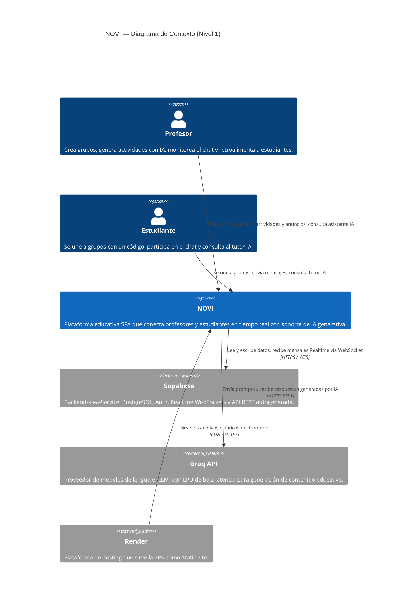

# C4 — Nivel 1: Diagrama de Contexto

> Muestra NOVI como sistema y cómo interactúa con los actores externos.

---

## Descripción de los actores

| Actor / Sistema | Rol |
|----------------|-----|
| **Profesor** | Usuario primario que administra el grupo y usa las herramientas de IA |
| **Estudiante** | Usuario secundario que consume el chat y el tutor académico |
| **NOVI** | SPA React — toda la lógica de UI y llamadas a servicios externos |
| **Supabase** | Único backend: base de datos, auth, Realtime y API REST |
| **Groq API** | Proveedor externo de LLM para las 7 funciones de IA |
| **Render** | CDN que sirve el bundle Vite compilado |
