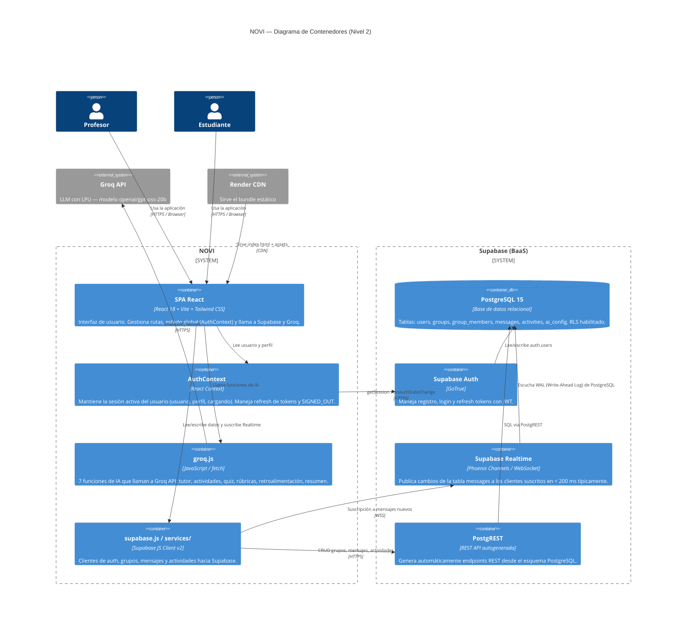

# C4 — Nivel 2: Diagrama de Contenedores

> Muestra los contenedores técnicos que componen NOVI y sus interacciones.



---

## Flujo crítico: envío de mensaje en tiempo real

```
Estudiante → SPA → supabase.from('messages').insert(...)
                 → PostgREST → PostgreSQL (INSERT)
                             → WAL → Supabase Realtime
                                   → WebSocket → SPA de todos los miembros
                                               → re-render del chat
```

Tiempo total esperado: **P50 ~250 ms, P95 ~580 ms** (medido en corridas 2 y 3).
