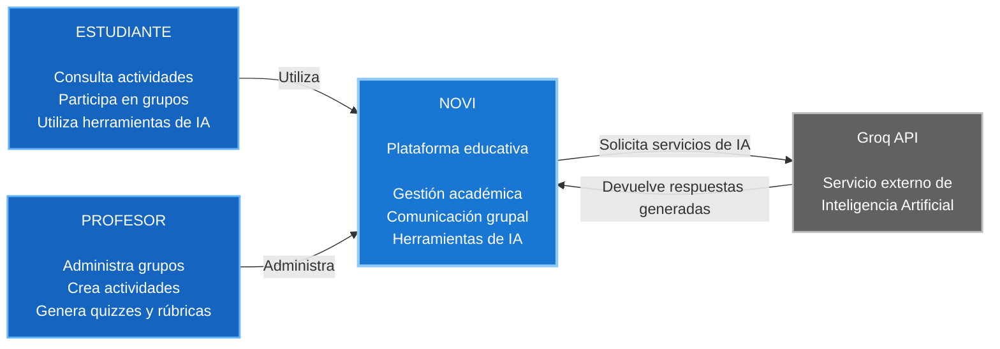

```mermaid 
flowchart LR

EST["ESTUDIANTE

Consulta actividades
Participa en grupos
Utiliza herramientas de IA"]

PROF["PROFESOR

Administra grupos
Crea actividades
Genera quizzes y rúbricas"]

NOVI["NOVI

Plataforma educativa

Gestión académica
Comunicación grupal
Herramientas de IA"]

GROQ["Groq API

Servicio externo de
Inteligencia Artificial"]

EST -->|"Utiliza"| NOVI
PROF -->|"Administra"| NOVI
NOVI -->|"Solicita servicios de IA"| GROQ
GROQ -->|"Devuelve respuestas generadas"| NOVI

classDef person fill:#1565C0,stroke:#64B5F6,color:#FFFFFF,stroke-width:2px;
classDef system fill:#1976D2,stroke:#90CAF9,color:#FFFFFF,stroke-width:3px;
classDef external fill:#616161,stroke:#BDBDBD,color:#FFFFFF,stroke-width:2px;

class EST,PROF person;
class NOVI system;
class GROQ external;


```
