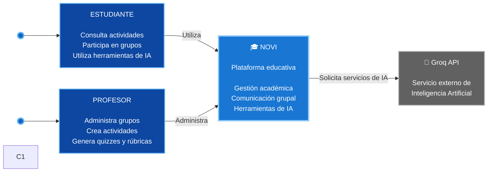

```mermaid
  flowchart LR

E@{ shape: f-circ, label: "👨‍🎓" }
P@{ shape: f-circ, label: "👨‍🏫" }

E1["ESTUDIANTE

Consulta actividades
Participa en grupos
Utiliza herramientas de IA"]

P1["PROFESOR

Administra grupos
Crea actividades
Genera quizzes y rúbricas"]

N["🎓 NOVI

Plataforma educativa

Gestión académica
Comunicación grupal
Herramientas de IA"]

G["🤖 Groq API

Servicio externo de
Inteligencia Artificial"]


E --> E1
E1 -->|"Utiliza"| N

P --> P1
P1 -->|"Administra"| N

N -->|"Solicita servicios de IA"| G


classDef person fill:#1565C0,stroke:#64B5F6,color:#FFFFFF,stroke-width:3px;
classDef description fill:#0D47A1,stroke:#64B5F6,color:#FFFFFF,stroke-width:2px;
classDef system fill:#1976D2,stroke:#90CAF9,color:#FFFFFF,stroke-width:3px;
classDef external fill:#616161,stroke:#BDBDBD,color:#FFFFFF,stroke-width:2px;

class E,P person;
class E1,P1 description;
class N system;
class G external;

C1
```
