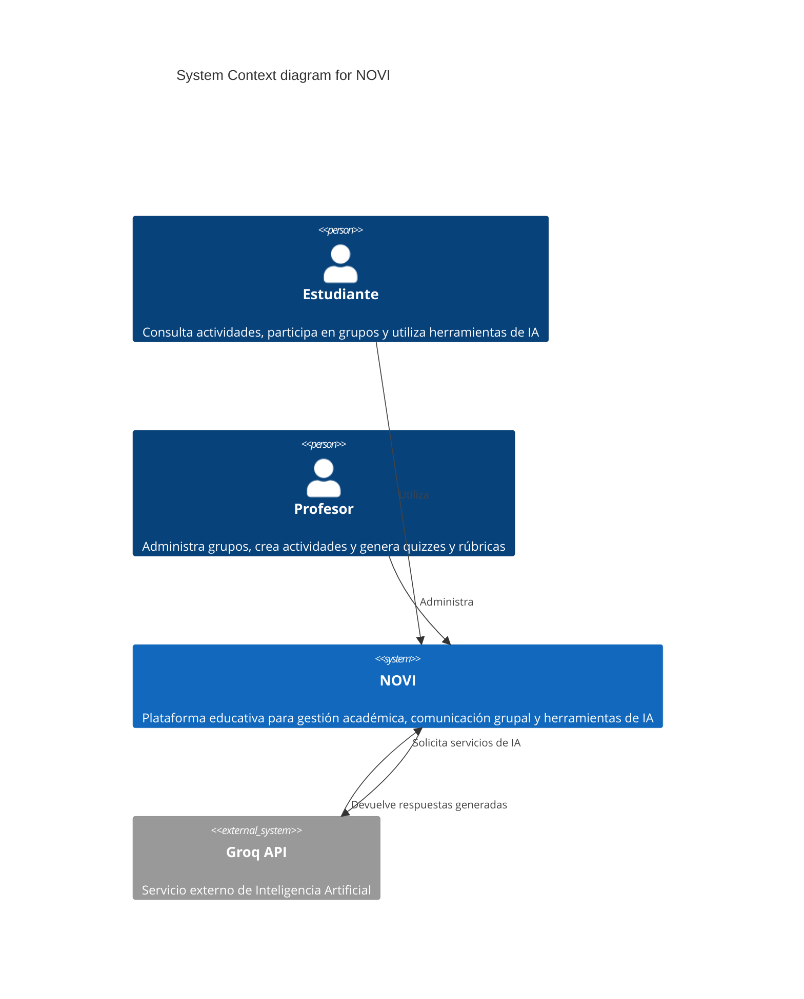

```mermaid 
C4Context
  title System Context diagram for NOVI

  Person(estudiante, "Estudiante", "Consulta actividades, participa en grupos y utiliza herramientas de IA")
  Person(profesor, "Profesor", "Administra grupos, crea actividades y genera quizzes y rúbricas")
  System(novi, "NOVI", "Plataforma educativa para gestión académica, comunicación grupal y herramientas de IA")
  System_Ext(groq, "Groq API", "Servicio externo de Inteligencia Artificial")

  Rel(estudiante, novi, "Utiliza")
  Rel(profesor, novi, "Administra")
  Rel(novi, groq, "Solicita servicios de IA")
  Rel(groq, novi, "Devuelve respuestas generadas")

  UpdateRelStyle(novi, groq, $offsetY="-35", $offsetX="35")
  UpdateRelStyle(groq, novi, $offsetY="35", $offsetX="-35")

  UpdateLayoutConfig($c4ShapeInRow="2", $c4BoundaryInRow="1")
```
