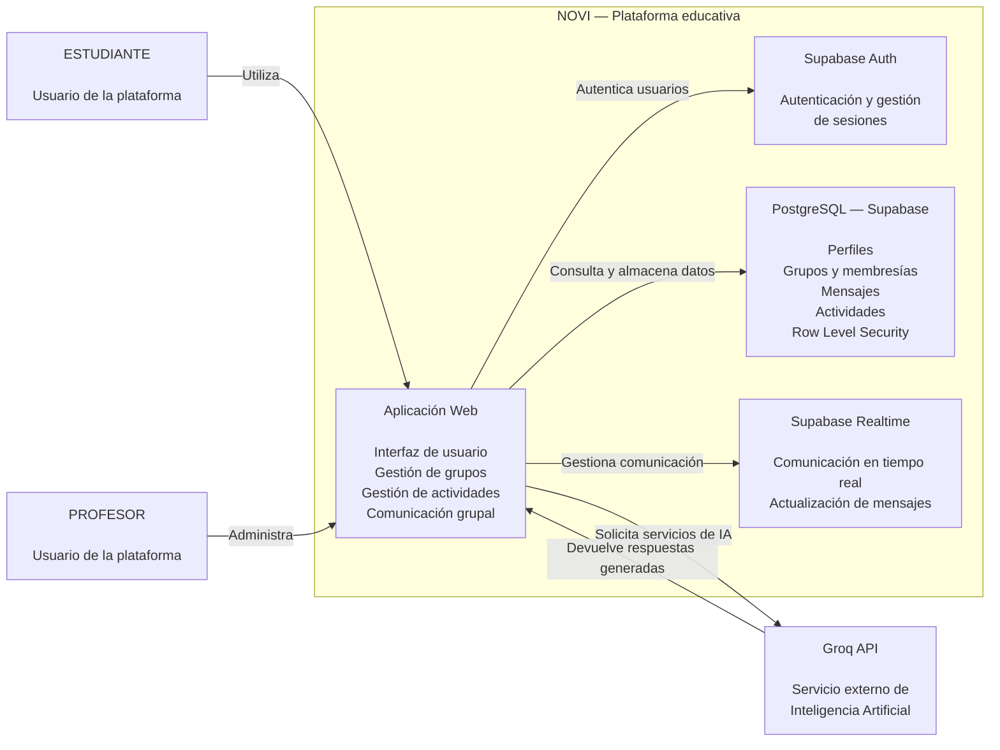

```mermaid
  flowchart LR

    EST["ESTUDIANTE<br/><br/>Usuario de la plataforma"]
    PROF["PROFESOR<br/><br/>Usuario de la plataforma"]

    subgraph NOVI["NOVI — Plataforma educativa"]
        direction TB

        WEB["Aplicación Web<br/><br/>Interfaz de usuario<br/>Gestión de grupos<br/>Gestión de actividades<br/>Comunicación grupal"]

        AUTH["Supabase Auth<br/><br/>Autenticación y gestión<br/>de sesiones"]

        DB["PostgreSQL — Supabase<br/><br/>Perfiles<br/>Grupos y membresías<br/>Mensajes<br/>Actividades<br/>Row Level Security"]

        REALTIME["Supabase Realtime<br/><br/>Comunicación en tiempo real<br/>Actualización de mensajes"]

        WEB -->|"Autentica usuarios"| AUTH
        WEB -->|"Consulta y almacena datos"| DB
        WEB -->|"Gestiona comunicación"| REALTIME
    end

    GROQ["Groq API<br/><br/>Servicio externo de<br/>Inteligencia Artificial"]

    EST -->|"Utiliza"| WEB
    PROF -->|"Administra"| WEB
    WEB -->|"Solicita servicios de IA"| GROQ
    GROQ -->|"Devuelve respuestas generadas"| WEB
```
