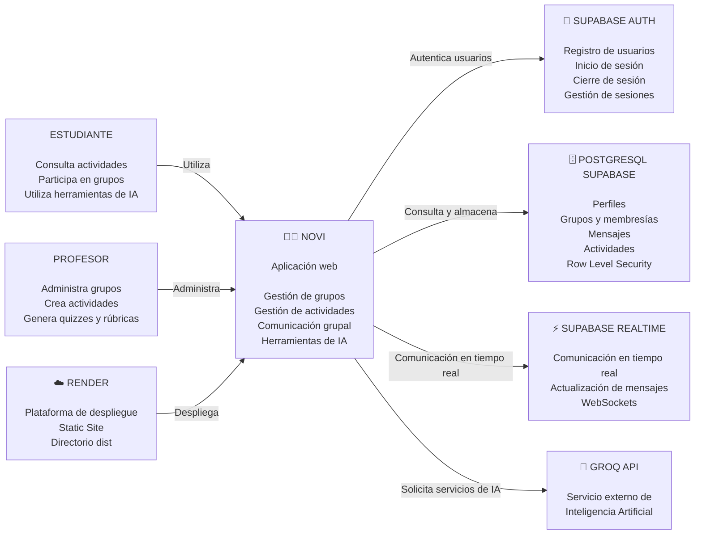

```mermaid
  flowchart LR

E1["ESTUDIANTE

Consulta actividades
Participa en grupos
Utiliza herramientas de IA"]

P1["PROFESOR

Administra grupos
Crea actividades
Genera quizzes y rúbricas"]

N["🧑‍💻 NOVI

Aplicación web

Gestión de grupos
Gestión de actividades
Comunicación grupal
Herramientas de IA"]

A["🔐 SUPABASE AUTH

Registro de usuarios
Inicio de sesión
Cierre de sesión
Gestión de sesiones"]

DB["🗄️ POSTGRESQL SUPABASE

Perfiles
Grupos y membresías
Mensajes
Actividades
Row Level Security"]

R["⚡ SUPABASE REALTIME

Comunicación en tiempo real
Actualización de mensajes
WebSockets"]

G["🤖 GROQ API

Servicio externo de
Inteligencia Artificial"]

RE["☁️ RENDER

Plataforma de despliegue
Static Site
Directorio dist"]

E1 -->|"Utiliza"| N
P1 -->|"Administra"| N

N -->|"Autentica usuarios"| A
N -->|"Consulta y almacena"| DB
N -->|"Comunicación en tiempo real"| R
N -->|"Solicita servicios de IA"| G

RE -->|"Despliega"| N
```
