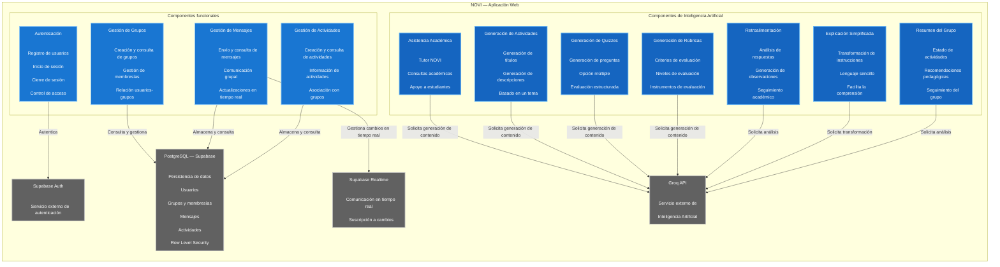

```mermaid
  flowchart TB

    subgraph NOVI["NOVI — Aplicación Web"]
        direction TB

        subgraph CORE["Componentes funcionales"]
            direction LR

            AUTHC["Autenticación<br/><br/>
            Registro de usuarios<br/>
            Inicio de sesión<br/>
            Cierre de sesión<br/>
            Control de acceso"]

            GROUP["Gestión de Grupos<br/><br/>
            Creación y consulta de grupos<br/>
            Gestión de membresías<br/>
            Relación usuarios-grupos"]

            MSG["Gestión de Mensajes<br/><br/>
            Envío y consulta de mensajes<br/>
            Comunicación grupal<br/>
            Actualizaciones en tiempo real"]

            ACT["Gestión de Actividades<br/><br/>
            Creación y consulta de actividades<br/>
            Información de actividades<br/>
            Asociación con grupos"]
        end

        subgraph AI["Componentes de Inteligencia Artificial"]
            direction LR

            TUTOR["Asistencia Académica<br/><br/>
            Tutor NOVI<br/>
            Consultas académicas<br/>
            Apoyo a estudiantes"]

            GENACT["Generación de Actividades<br/><br/>
            Generación de títulos<br/>
            Generación de descripciones<br/>
            Basado en un tema"]

            QUIZ["Generación de Quizzes<br/><br/>
            Generación de preguntas<br/>
            Opción múltiple<br/>
            Evaluación estructurada"]

            RUBRIC["Generación de Rúbricas<br/><br/>
            Criterios de evaluación<br/>
            Niveles de evaluación<br/>
            Instrumentos de evaluación"]

            FEEDBACK["Retroalimentación<br/><br/>
            Análisis de respuestas<br/>
            Generación de observaciones<br/>
            Seguimiento académico"]

            EXPLAIN["Explicación Simplificada<br/><br/>
            Transformación de instrucciones<br/>
            Lenguaje sencillo<br/>
            Facilita la comprensión"]

            SUMMARY["Resumen del Grupo<br/><br/>
            Estado de actividades<br/>
            Recomendaciones pedagógicas<br/>
            Seguimiento del grupo"]
        end

        AUTHC -->|"Autentica"| AUTH
        GROUP -->|"Consulta y gestiona"| DB
        MSG -->|"Almacena y consulta"| DB
        ACT -->|"Almacena y consulta"| DB

        MSG -->|"Gestiona cambios en tiempo real"| RT

        TUTOR -->|"Solicita generación de contenido"| GROQ
        GENACT -->|"Solicita generación de contenido"| GROQ
        QUIZ -->|"Solicita generación de contenido"| GROQ
        RUBRIC -->|"Solicita generación de contenido"| GROQ
        FEEDBACK -->|"Solicita análisis"| GROQ
        EXPLAIN -->|"Solicita transformación"| GROQ
        SUMMARY -->|"Solicita análisis"| GROQ
    end

    AUTH["Supabase Auth<br/><br/>
    Servicio externo de autenticación"]

    DB["PostgreSQL — Supabase<br/><br/>
    Persistencia de datos<br/>
    Usuarios<br/>
    Grupos y membresías<br/>
    Mensajes<br/>
    Actividades<br/>
    Row Level Security"]

    RT["Supabase Realtime<br/><br/>
    Comunicación en tiempo real<br/>
    Suscripción a cambios"]

    GROQ["Groq API<br/><br/>
    Servicio externo de<br/>
    Inteligencia Artificial"]

    classDef component fill:#1976D2,stroke:#90CAF9,color:#FFFFFF,stroke-width:2px;
    classDef ai fill:#1565C0,stroke:#64B5F6,color:#FFFFFF,stroke-width:2px;
    classDef external fill:#616161,stroke:#BDBDBD,color:#FFFFFF,stroke-width:2px;

    class AUTHC,GROUP,MSG,ACT component;
    class TUTOR,GENACT,QUIZ,RUBRIC,FEEDBACK,EXPLAIN,SUMMARY ai;
    class AUTH,DB,RT,GROQ external;
```
