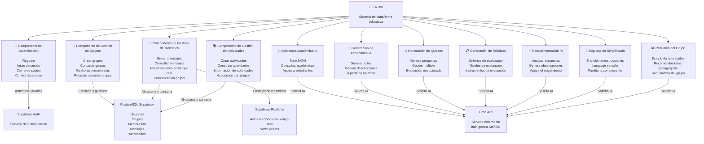

```mermaid
  flowchart TB

N["🧑‍💻 NOVI

Sistema de plataforma educativa"]

A["🔐 Componente de Autenticación

Registro
Inicio de sesión
Cierre de sesión
Control de acceso"]

G["👥 Componente de Gestión de Grupos

Crear grupos
Consultar grupos
Gestionar membresías
Relación usuarios-grupos"]

M["💬 Componente de Gestión de Mensajes

Enviar mensajes
Consultar mensajes
Actualizaciones en tiempo real
Comunicación grupal"]

AC["📚 Componente de Gestión de Actividades

Crear actividades
Consultar actividades
Información de actividades
Asociación con grupos"]

IA1["🤖 Asistencia Académica IA

Tutor NOVI
Consultas académicas
Apoyo a estudiantes"]

IA2["✨ Generación de Actividades IA

Genera títulos
Genera descripciones
A partir de un tema"]

IA3["📝 Generación de Quizzes

Genera preguntas
Opción múltiple
Evaluación estructurada"]

IA4["📋 Generación de Rúbricas

Criterios de evaluación
Niveles de evaluación
Instrumentos de evaluación"]

IA5["💡 Retroalimentación IA

Analiza respuestas
Genera observaciones
Apoya el seguimiento"]

IA6["📖 Explicación Simplificada

Transforma instrucciones
Lenguaje sencillo
Facilita la comprensión"]

IA7["📊 Resumen del Grupo

Estado de actividades
Recomendaciones pedagógicas
Seguimiento del grupo"]

AUTH["Supabase Auth

Servicio de autenticación"]

DB["PostgreSQL Supabase

Usuarios
Grupos
Membresías
Mensajes
Actividades"]

RT["Supabase Realtime

Actualizaciones en tiempo real
WebSockets"]

GROQ["Groq API

Servicio externo de
Inteligencia Artificial"]

N --> A
N --> G
N --> M
N --> AC
N --> IA1
N --> IA2
N --> IA3
N --> IA4
N --> IA5
N --> IA6
N --> IA7

A -->|"Autentica usuarios"| AUTH

G -->|"Consulta y gestiona"| DB
M -->|"Almacena y consulta"| DB
AC -->|"Almacena y consulta"| DB

M -->|"Suscripción a cambios"| RT

IA1 -->|"Solicita IA"| GROQ
IA2 -->|"Solicita IA"| GROQ
IA3 -->|"Solicita IA"| GROQ
IA4 -->|"Solicita IA"| GROQ
IA5 -->|"Solicita IA"| GROQ
IA6 -->|"Solicita IA"| GROQ
IA7 -->|"Solicita IA"| GROQ
```
